# EurekaArchiTech 🚀

**Transformación Digital Empresarial | AI-First Consulting**

<div align="center">

[](https://eureka-architech.com)
[](https://linkedin.com/company/eureka-architech)
[](mailto:hi@eureka-architech.com)

</div>

## 🌟 Sobre Nosotros

EurekaArchiTech es una consultora especializada en **transformación digital** que empodera a las organizaciones mediante soluciones innovadoras, liderazgo estratégico y excelencia operacional, garantizando **resultados medibles y sostenibles**.

### 🎯 Servicios Principales

<table>
<tr>
<td width="50%">

**🏗️ Arquitectura Tecnológica Empresarial**
- Infraestructura cloud nativa
- Aplicaciones de negocio e IA
- Ciberseguridad empresarial

**👥 Mentoría Ejecutiva y Técnica**
- Desarrollo de capacidades C-Level
- Formación de equipos técnicos
- Coaching estratégico

</td>
<td width="50%">

**📈 Liderazgo Estratégico como Servicio**
- Ejecutivos temporales especializados
- Gestión de transformación digital
- Change management

**🤖 Metodología EUREKA**
- Proceso estructurado en 6 fases
- Transferencia de conocimiento completa
- Autonomía garantizada

</td>
</tr>
</table>

## 📊 Resultados Comprobados

<div align="center">

| Métrica | Resultado |
|---------|-----------|
| 🎯 **Tasa de Éxito** | **95%** en proyectos |
| 💰 **Reducción de Costos** | **40%** promedio |
| ⚡ **Tiempo de Activación** | **48 horas** |
| 📈 **ROI Garantizado** | **2-3x** en implementaciones |

</div>

## 🤖 Metodología EUREKA

Nuestro proceso estructurado de transformación digital:

```mermaid
graph LR
    E[📋 Evaluación<br/>integral] --> U[🔄 Unificación<br/>de procesos]
    U --> R[🏗️ Rediseño<br/>estratégico]
    R --> E2[⚡ Ejecución<br/>controlada]
    E2 --> K[🎓 Knowledge<br/>transfer]
    K --> A[🏆 Autonomía<br/>garantizada]

    style E fill:#e3f2fd
    style U fill:#f3e5f5
    style R fill:#e8f5e8
    style E2 fill:#fff3e0
    style K fill:#fce4ec
    style A fill:#e0f2f1
```



## 🚀 Stack Tecnológico

<div align="center">

### Frontend


### Backend & Infrastructure


</div>

## 👥 Equipo de Liderazgo

<table>
<tr>
<td align="center" width="50%">
  <br>
  <strong>Oscar Valois Martínez</strong><br>
  <sub>Director de Tecnología</sub><br>
  <sub>12+ años experiencia</sub><br>
  <sub>Solutions Architect senior</sub>
</td>
<td align="center" width="50%">
  <strong>Jorge Alberto Virgen Montesinos</strong><br>
  <sub>Director de Arquitectura Empresarial</sub><br>
  <sub>21+ años experiencia</sub><br>
  <sub>Ex-Subdirector Arquitectura servicios financieros</sub>
</td>
</tr>
</table>

## 🎯 Casos de Éxito

### 🏦 Hergon Systems - Servicios Financieros
- **Cliente**: [Hergon Systems Solution](https://sishergon.com.mx/)
- **ROI**: 2.8x en 12 meses
- **Mejoras**: 40% reducción tiempo procesamiento
- **Satisfacción**: 50% mejora en experiencia cliente
- **Resultado**: 100% equipo capacitado en nuevas tecnologías

### 📊 Transformación Digital Integral
- **Arquitectura**: Modernización de sistemas legacy
- **Liderazgo**: 6 meses de mentoría ejecutiva
- **Equipo**: 3 recursos técnicos especializados
- **Certificación**: 100% cumplimiento normativo CONSAR

## 🌍 Presencia y Mercado

<div align="center">

**🇲🇽 México** • **PyMEs 50-500 empleados** • **Sectores múltiples**

| Sector | Proyectos | ROI Promedio |
|--------|-----------|--------------|
| 🏦 Servicios Financieros | 1 | 2.8x |
| 🏗️ Arquitectura Empresarial | 3+ | 3.2x |
| 💼 Transformación Digital | 5+ | 2.5x |
| 🤖 Modernización Legacy | 2+ | 3.1x |

</div>

## 📈 Crecimiento y Proyecciones

```
2024 ████████████████████████████████████████ Fundación & Validación
2025 ████████████████████████████████████████ $18M MXN ARR • 15 clientes
2026 ████████████████████████████████████████ $55M MXN ARR • 150 clientes
2027 ████████████████████████████████████████ $120M MXN ARR • 500+ clientes
```

## 🤝 Colabora con Nosotros

### Para Empresas
- 📞 **Diagnóstico Digital Gratuito**: [Solicitar aquí](https://eureka-architech.com/contacto)
- 💼 **Casos de Uso Personalizados**: Adaptamos soluciones a tu industria
- 🎯 **ROI Garantizado**: Resultados medibles desde el día 1

### Para Desarrolladores
- 🚀 **Open Source**: Contribuye a nuestros proyectos públicos
- 🎓 **Programa de Mentoría**: Desarrollo de talento tech
- 💡 **Innovación**: Únete al futuro de la consultoría AI-First

---

<div align="center">

### 🚀 Transformando el futuro digital de las empresas mexicanas

**Hecho con ❤️ y tecnología de vanguardia por el equipo EurekaArchiTech**

[🌐 Website](https://eureka-architech.com) • [📧 Email](mailto:hi@eureka-architech.com) • [💼 LinkedIn](https://linkedin.com/company/eureka-architech)

</div>